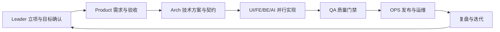

# 企业级数字员工组织架构（ORG ARCH）

本文档用于定义 `openclaw-biz-agent` 的数字员工组织结构、职责边界与协作关系，作为项目立项后执行编排的基础规范。

## 1. 组织目标

- 在 Leader 确认目标后，形成可持续的 7x24 任务执行能力。
- 将“需求 -> 方案 -> 开发 -> 测试 -> 发布 -> 复盘”流程标准化、可追溯。
- 通过角色分工 + MCP + Skills，提升交付效率与稳定性。

## 2. 角色与职责

| 角色 | 名字 | 核心职责 | 关键输出 |
|---|---|---|---|
| Team Leader | 郑吒 | 立项、派单、节奏控制、风险仲裁 | `plan/`、全局调度记录 |
| 产品经理 | 楚轩 | 需求澄清、PRD、验收标准、业务指标 | `product/` 文档与验收定义 |
| 架构师 | 萧宏律 | 技术蓝图、接口契约、非功能基线 | `architecture/`、技术契约 |
| UI 设计 | 铭烟薇 | 视觉规范、交互方案、设计资产 | 设计稿、规范、标注 |
| 前端开发 | 罗甘道 | 页面实现、状态管理、前端集成 | `tech/frontend/` |
| 后端开发 | 罗应龙 | 服务/API/数据实现、稳定性保障 | `tech/backend/` |
| AI 专家 | 赵樱空 | 模型策略、RAG、提示与评测治理 | `tech/ai/` |
| QA 测试 | 詹岚 | 测试策略、质量门禁、放行建议 | `qa/` 报告与缺陷矩阵 |
| 运维/DBA | 张杰 | 发布、监控、容量、数据库变更 | `ops/` 发布与运维文档 |

## 3. RACI（简化）

说明：`R` 负责执行，`A` 最终负责，`C` 咨询，`I` 知会。

| 活动 | Leader | Product | Arch | UI | FE | BE | AI | QA | OPS |
|---|---|---|---|---|---|---|---|---|---|
| 立项与目标冻结 | A | R | C | I | I | I | I | I | I |
| PRD 与验收标准 | C | A/R | C | C | I | I | C | C | I |
| 架构与接口评审 | C | C | A/R | I | C | C | C | I | C |
| 设计方案输出 | I | C | C | A/R | C | I | I | I | I |
| 开发实现 | I | I | C | C | A/R | A/R | A/R | I | I |
| 测试与放行建议 | I | I | I | I | C | C | C | A/R | C |
| 发布与回滚执行 | C | I | C | I | I | C | I | C | A/R |
| 复盘与优化闭环 | A | C | C | C | C | C | C | C | C |

## 4. 组织协同图

## 5. 升级与冲突处理

- 跨角色冲突统一升级到 Leader 决策。
- 影响范围超出单项目时，进入项目级决策会议。
- 生产风险、合规风险、数据风险触发最高优先级处理。

## 6. 执行约束

- 未经过 Gate 评审，不进入下一阶段。
- 任何 `blocked` 任务必须明确“阻塞原因 + 需协调项 + 预期恢复条件”。
- 所有关键节点必须留痕（任务、决策、产物路径、验证结果）。
