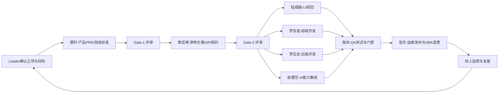
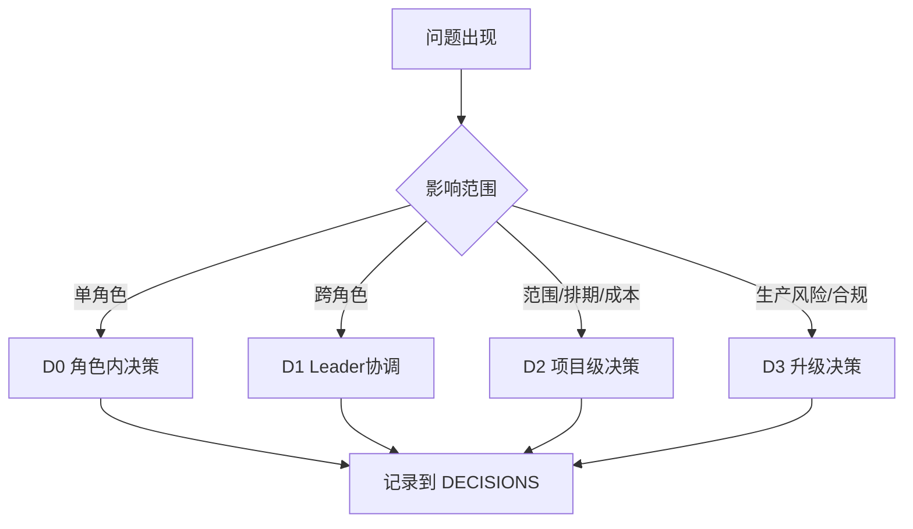
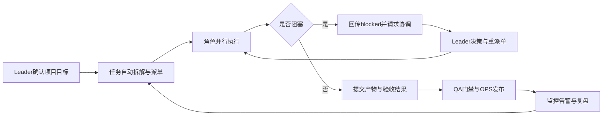

# OpenClaw 企业级数字员工项目（openclaw-biz-agent）

本仓库用于构建一个**基于 OpenClaw 的企业级数字员工团队**：在 Leader 确认项目目标后，由多角色数字员工进行 7x24 小时持续协作，完成从需求到上线运维的闭环交付。

上游项目：`https://github.com/openclaw/openclaw`

扩展文档：

- `ORG_ARCH.md`（组织架构与 RACI）
- `RUNBOOK_7x24.md`（7x24 运行手册）

## 作者简介

### 霍钧城（分布式 AI 架构师）

具备多年企业级研发与架构经验，长期聚焦“高并发分布式系统 + 业务中台 + AI Agent 工程化落地”的融合实践。

联系方式：`howard_007@163.com`

- 擅长企业级架构设计与高可用治理，具备从单体到微服务的演进经验。
- 深度参与 B2B2C 电商与供应链核心链路建设，具备支付中台与分账结算实践。
- 聚焦 AI Agent 工程化落地，覆盖 RAG、Tool Calling、MCP 与 Skills 资产化建设。

## 本次改进点（2026-03-12）

- 为多角色协议文件补充 Mattermost 快速已读规则：收到消息先加 `:ok_hand:`，再回执 `已接单/done/blocked`。
- 清理历史示例交付物（`projects/login-page-delivery` 与 `projects/common-ui-components` 下旧文档与图片），降低仓库冗余。
- 保留并强化“Leader 统一调度、角色标准回执”的协作约束，便于后续任务编排与过程审计。

## 本次改进点（2026-03-15）

- 技能目录结构完成迁移：各角色从 `<role>/.agents/skills` 逐步切换到 `<role>/skills`，统一技能管理与复用路径。
- Leader 协调能力增强：新增项目频道引导与派单编排相关技能，补充跨频道协同的引导流程。
- 清理历史项目与冗余资产：归档/移除旧交付样例与过期素材，降低仓库体积并提升检索效率。

---

## 角色设定来源（可直接阅读）

本 README 的组织设定来自以下角色协议文件：

- `leader/AGENTS.md`
- `product/AGENTS.md`
- `arch/AGENTS.md`
- `ui/AGENTS.md`
- `fe/AGENTS.md`
- `be/AGENTS.md`
- `ai/AGENTS.md`
- `qa/AGENTS.md`
- `ops/AGENTS.md`

---

## 企业级数字员工编制（名字 + 职能）

| 名字 | 角色 | 核心职能 | 主要交付目录 | Mattermost 账号 |
|---|---|---|---|---|
| 郑吒 | Team Leader | 立项确认、派单调度、风险仲裁、节奏推进 | `projects/<project>/plan/` | `@bot-leader` |
| 楚轩 | 产品经理 | PRD、业务目标、验收标准、价值评估 | `projects/<project>/product/` | `@bot-product` |
| 萧宏律 | 架构师 | 架构蓝图、接口契约、性能与安全基线 | `projects/<project>/architecture/` | `@bot-arch` |
| 铭烟薇 | UI 设计 | 视觉规范、交互方案、设计系统 | `projects/<project>/product/`、`deliverables/` | `@bot-ui` |
| 罗甘道 | 前端开发 | 页面与交互实现、前端工程化、可观测埋点 | `projects/<project>/tech/frontend/` | `@bot-fe` |
| 罗应龙 | 后端开发 | 服务/API/数据实现、性能稳定性保障 | `projects/<project>/tech/backend/` | `@bot-be` |
| 赵樱空 | AI 专家 | 模型策略、RAG、Prompt、评测与安全治理 | `projects/<project>/tech/ai/` | `@bot-ai` |
| 詹岚 | QA 测试 | 测试策略、质量门禁、发布放行建议 | `projects/<project>/qa/` | `@bot-test` |
| 张杰 | 运维/DBA | 部署发布、监控告警、数据库变更与容灾 | `projects/<project>/ops/` | `@bot-ops` |

---

## 协同关系（组织流程）

协同规则要点：

- 跨角色行动统一由 Leader 调度，避免越级协作失控。
- 所有角色必须在频道回执 `已接单 / done / blocked`。
- 未过 Gate 不进入下一阶段，保证质量与节奏可控。

---

## 任务体系（Task System）

任务采用“目标到执行”五层结构：

- `L0` 项目目标：业务目标、上线窗口、核心 KPI。
- `L1` 里程碑：需求冻结、方案冻结、开发完成、测试放行、上线完成。
- `L2` 史诗任务：按业务域拆分（登录、订单、支付、客服等）。
- `L3` 角色任务：按 owner 分配到 `product/arch/ui/fe/be/ai/qa/ops`。
- `L4` 执行项：可落地、可验证、可追溯的最小工作单元。

状态流：`todo -> doing -> review -> done`（阻塞统一标注 `blocked` 并回传 Leader）。

任务源：

- 项目化任务：`projects/<project>/plan/TASKS.json`
- 日常任务：`tasks/TASKS.csv`

---

## 通讯体系（Communication System）

统一通信平台：`Mattermost (http://localhost:8065)`

通信原则：

- Leader 是唯一跨角色调度入口。
- 派单、回执、阻塞、催办都在团队频道完成。
- 附件发送必须走工具并带真实文件，不允许“口头已发送”。

标准消息模板：

- 接单：`@bot-leader 【角色】已接单 | 任务ID | 预计完成时间`
- 完成：`@bot-leader 【角色】done | 产物路径 | 验证结果`
- 阻塞：`@bot-leader 【角色】blocked | 阻塞原因 | 需协调项`

---

## 决策体系（Decision System）

按影响范围分层决策：

- `D0` 角色内技术决策：角色自主决策并留痕。
- `D1` 跨角色协作决策：Leader 主持，相关角色会签。
- `D2` 项目级范围/排期/成本决策：Leader + 产品 + 架构。
- `D3` 生产风险/合规/数据安全决策：Leader 触发升级流程。

决策记录统一写入：`projects/<project>/decisions/DECISIONS.md`

---

## 会话体系（Session System）

为保证 7x24 连续工作，会话按三层组织：

- 项目会话：项目全局上下文（目标、范围、里程碑、风险）。
- 角色会话：角色专属上下文（职责、依赖、当前执行项）。
- 议题会话：特定问题（缺陷、接口变更、线上告警）短周期处理。

上下文策略：

- 短期上下文：当前任务输入输出与最新决策。
- 长期上下文：项目知识、标准规范、历史复盘。
- 会话交接：每次 `done/blocked` 必带“下一步建议”，支持无缝接力。

---

## 技能体系（Skills + MCP）

数字员工能力由两层组成：

- `MCP`：连接企业系统能力（工单、订单、知识库、报表、审批等）。
- `Skills`：标准化业务技能包（可复用、可版本化、可灰度）。

技能生命周期：

1. 需求提出（业务场景定义）
2. 技能设计（输入/输出/边界/回滚）
3. 评测验收（准确率、成本、时延、风险）
4. 发布上架（版本号、适用范围）
5. 运行观测（命中率、失败率、人工兜底率）
6. 迭代下线（新版本替换或归档）

---

## 7x24 连续工作机制

Leader 与数字员工协作进入“持续执行模式”后，系统按事件驱动自动循环：

运行保障机制：

- 任务超时自动告警与催办。
- 阻塞自动升级到 Leader。
- 关键节点（评审、放行、发布）强制留痕。
- 通过“回执规范 + 决策留痕 + 会话交接”实现不中断协作。

---

## 工作区目录

- `projects/`：项目主目录（计划、产物、决策、交付）
- `tasks/`：日常任务池（非项目化）
- `leader/`：调度与编排中心
- `product/` `arch/` `ui/` `fe/` `be/` `ai/` `qa/` `ops/`：各角色执行空间

## 工程目录产出参考（效果示例）

为便于快速理解“每个目录会产出什么”，可直接参考以下现有样例：

- 项目总计划：`projects/login-page-delivery/plan/PROJECT.md`
- 产品 PRD：`projects/login-page-delivery/product/PRD_T2_登录页.md`
- 架构方案：`projects/login-page-delivery/architecture/ARCH_Auth_CORS_联调方案_20260307.md`
- 后端接口契约：`projects/login-page-delivery/tech/backend/AUTH_API_CONTRACT.md`
- OpenAPI 示例：`projects/yajiang-hr-vue3-upgrade/tech/backend/OPENAPI.yaml`
- UI 规范：`projects/login-page-delivery/ui/UI_Login_v1_Spec.md`
- QA 用例：`projects/login-page-delivery/qa/QA_Login_TestCases_20260307.md`
- 运维发布方案：`projects/login-page-delivery/ops/OPS_Local_Deploy_Plan_20260307.md`
- 交付清单：`projects/login-page-delivery/deliverables/ARTIFACTS.md`

查看这些文件后，可以直观看到：

- 从需求到上线的链路产物是完整的。
- 每个角色都有对应交付目录与标准文档。
- 产物命名与归档方式可直接复用到新项目。

---

## 作者介绍

### 霍钧城（分布式 AI 架构师）

具备多年企业级研发与架构经验，长期聚焦“高并发分布式系统 + 业务中台 + AI Agent 工程化落地”的融合实践。

联系方式：`howard_007@163.com`

**技术架构能力（Technical Architecture）**

- 具备从单体到微服务的架构演进经验，熟悉 Spring Cloud、网关、配置中心、任务调度、消息中间件与可观测体系建设。
- 擅长高并发与高可用设计，围绕缓存分层、异步解耦、分布式锁、最终一致性、熔断限流等方案提升系统稳定性。
- 有云原生工程化落地经验，能够基于 Docker/K8s/Jenkins/DevOps 构建持续交付与自动化发布体系。

**业务架构能力（Business Architecture）**

- 深度参与 B2B2C 电商与供应链场景，覆盖商品、订单、库存、支付、分账、结算、对账等核心链路。
- 具备统一支付中台设计经验，支持多支付渠道接入、多级分账与实时结算，保障交易链路一致性与可追踪性。
- 面向业务智能化升级，推动企业级 Agent 在客服、运营、风控、供应链协同等场景落地，形成“人+AI+系统”协作闭环。

**AI 架构能力（AI Architecture / Agent Engineering）**

- 具备大模型平台化搭建与使用能力，支持多模型接入、模型路由、推理参数治理与成本/延迟/效果平衡。
- 采用 RAG + Hybrid Search + Rerank 架构，提升企业知识问答准确率与可解释性。
- 结合 Function Calling / Tool Calling 实现“自然语言意图 -> 业务操作执行”闭环。
- 构建 MCP（Model Context Protocol）工具生态，沉淀 MCP Server 与标准化能力接口。
- 建设 Skills 资产体系，将高频业务能力封装为可复用 Skill，支持版本化与持续迭代。
- 推动 Multi-Agent 协作与数字员工体系建设，支撑企业 AI 应用规模化落地。
