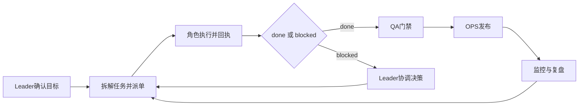

# 7x24 连续工作运行手册（RUNBOOK）

本文档定义 `openclaw-biz-agent` 的持续运行机制，确保在 Leader 确认项目后，数字员工可稳定进行全天候协作。

## 1. 运行目标

- 关键任务不掉线：任务有接单、有回执、有闭环。
- 关键节点可追溯：评审、放行、发布有记录。
- 异常可恢复：阻塞可升级、故障可回滚、责任可定位。

## 2. 标准工作循环

## 3. 值守节奏

- 常规巡检：每 30 分钟检查任务状态与阻塞队列。
- 关键窗口（发布前后）：每 5 分钟同步一次风险状态。
- 每日复盘：汇总 `done/blocked`、缺陷趋势、产物完整性。

## 4. SLA 建议

- 接单响应：`<= 5 分钟`
- 阻塞上报：`<= 10 分钟`
- 关键故障升级：`<= 15 分钟`
- 发布回滚决策：`<= 30 分钟`

## 5. 阻塞升级机制

`L1` 角色内可解 -> 角色自行处理并留痕  
`L2` 跨角色依赖 -> 提交 Leader 协调  
`L3` 生产/合规风险 -> Leader 触发最高优先级处理

## 6. 观测与告警

- 任务维度：超时任务数、阻塞任务数、平均流转时长。
- 质量维度：缺陷率、回归失败率、放行驳回率。
- 运行维度：发布成功率、回滚次数、告警恢复时长。

## 7. 交接规范

每次 `done/blocked` 必须带上：

- 产物路径
- 验证结果
- 风险说明
- 下一步建议

保证任何时刻都可由其他角色或下一班次无缝接力。
