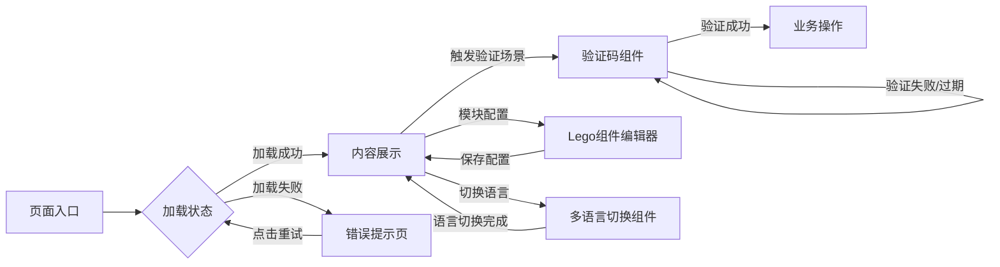

# 通用UI组件低保真原型蓝图
## 1. 页面流转图


## 2. 组件线框说明
### 2.1 加载状态组件线框
```
+---------------------------+
|  [Loading 动画]            |
|  ------------------------  |
|  ■■■■■■■■■■■■■■■■■■■■      |
|  ■■■■■■■■■■■■■■■■          |
|  ■■■■■■■■■■■■■■■■■■■■      |
|  (骨架屏占位)               |
+---------------------------+
```
交互：加载中不可点击，超时显示「加载失败，请重试」按钮

### 2.2 验证码组件线框
```
+---------------------------+
|  请输入验证码               |
|  +-------+  +---------+    |
|  | 验证码图 | | 刷新按钮 |   |
|  +-------+  +---------+    |
|  [输入框]                  |
|  [提交按钮]                 |
+---------------------------+
```
交互：刷新按钮点击更换验证码，输入错误实时提示，过期自动刷新

### 2.3 Lego组件线框
```
+---------------------------+
|  [Lego块1] [Lego块2]       |
|  ------------------------  |
|  [Lego块3] [Lego块4]       |
|  <拖拽手柄> <显隐开关>      |
+---------------------------+
```
交互：支持拖拽排序，点击显隐开关控制模块展示，右键可编辑配置

### 2.4 多语言切换组件线框
```
+---------------------------+
|  🌐 语言选择               |
|  ▢ 简体中文                |
|  ▢ English                |
|  ▢ 日本語                  |
|  ▢ 한국어                  |
+---------------------------+
```
交互：点击选中项即时切换全站语言，自动记忆选择

## 3. 组件与交互清单
| 组件名称 | 支持场景 | 可配置参数 |
|----------|----------|------------|
| 加载组件 | 页面/模块/按钮加载 | 加载文案、是否显示骨架屏、超时时间 |
| 验证码组件 | 登录/注册/操作验证 | 类型（图片/滑动/短信）、有效期、错误次数阈值 |
| Lego组件 | 模块化页面搭建 | 模块列表、排序规则、自定义配置项 |
| 多语言组件 | 全站国际化 | 支持语言列表、默认语言、兜底语言 |

## 4. 交付说明
本原型可直接交付UI团队进行高保真设计，或交付前端团队进行组件开发，所有交互规则与PRD保持一致。