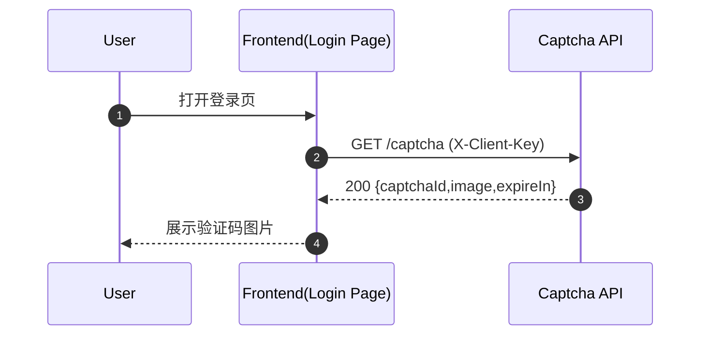
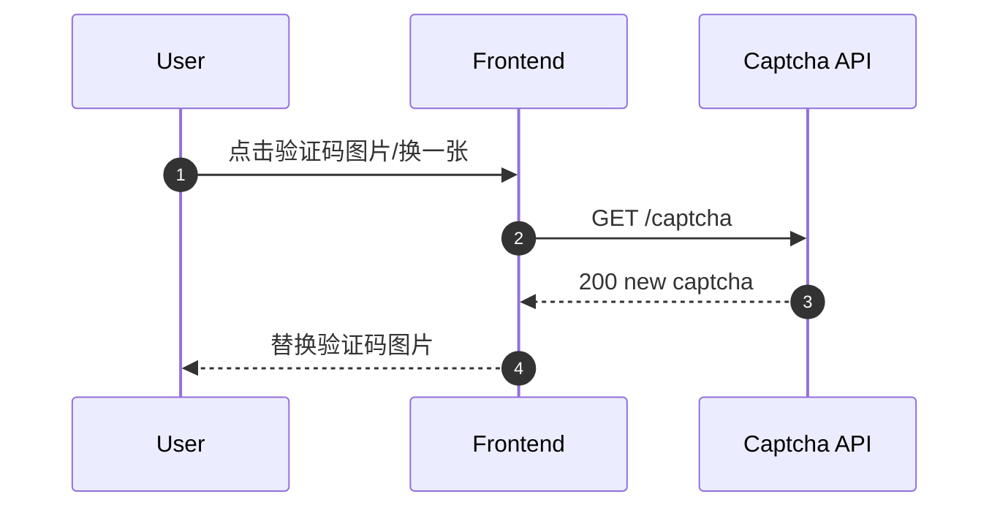
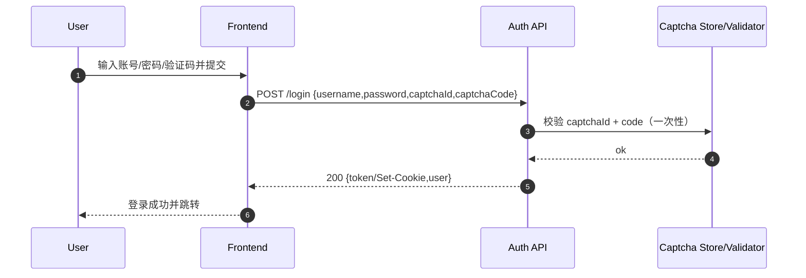
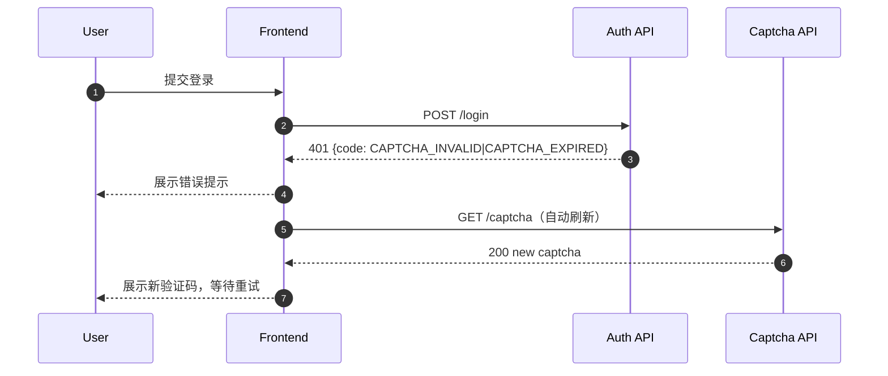
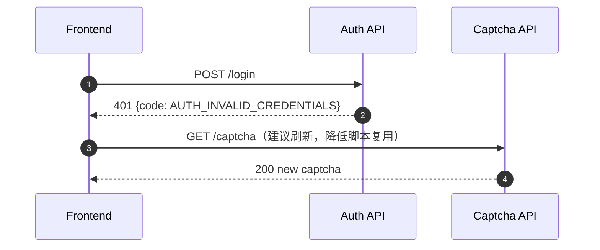

# Gate-2 架构/接口方案：登录 + 图形验证码（v1.0）

- 项目：`projects/tech-login-captcha-page`
- 输入（Gate-1 评审通过）：
  - PRD：`projects/tech-login-captcha-page/product/PRD.md`
  - 原型：`projects/tech-login-captcha-page/product/wireframe.png`
- 目标：对齐**可联调**的 `/captcha`、`/login` 契约；明确验证码刷新/失效与登录失败处理；给出安全基线。

---

## 0. 关键决策（建议默认）

1. **验证码为一次性凭据**：同一个 `captchaId` 在一次校验后即作废（无论成功/失败），防止重放。
2. **验证码与客户端弱绑定**（推荐）：对 `captchaId` 绑定 `clientKey`（例如匿名 cookie / 设备随机串）与/或 `ipPrefix`（可选，避免误伤移动网络）。
3. **错误提示不暴露账号枚举信息**：`AUTH_INVALID_CREDENTIALS` 统一表示账号/密码错误。
4. **限流与审计为必须项**：/captcha 与 /login 均做多维限流 + 关键字段审计。

> 若现有后端已有统一鉴权/错误包裹/限流中间件，本方案以“字段名/错误码可对齐现有规范”为准。

---

## 1. 组件与数据流（最小闭环）

- Web/APP（前端登录页）
- Auth Service（登录接口，校验凭据，签发会话）
- Captcha Service（可并入 Auth Service；负责生成/校验验证码）
- Redis/内存缓存（存储 captcha：TTL + 尝试次数 + 绑定信息）
- User Directory（用户库/统一身份源，沿用现有）
- Audit Log（登录审计日志，沿用现有日志体系）

数据流：
1) 前端 GET `/captcha` → 返回 `captchaId + image + expireIn`；
2) 前端 POST `/login`（携带 captchaId/code）→ Auth 校验 captcha → 校验用户名密码 → 成功签发 token/session。

---

## 2. 通用约定（请求/响应、错误包裹、头部）

### 2.1 Content-Type
- 请求/响应：`application/json; charset=utf-8`

### 2.2 错误响应格式（建议统一）
HTTP 状态码 + 业务错误码：
```json
{
  "code": "CAPTCHA_INVALID",
  "message": "captcha invalid",
  "requestId": "<trace-id>",
  "details": {
    "remainAttempts": 2,
    "captchaRefresh": true
  }
}
```
- `requestId`：对接现有链路追踪（便于排障）
- `details`：可选；严禁返回敏感信息（例如“账号不存在”）

### 2.3 安全相关响应头（建议）
- 全站：HTTPS；建议开启 HSTS。
- 登录页静态资源：建议 CSP（至少 `default-src 'self'`；如有第三方资源按白名单）
- `/captcha`：`Cache-Control: no-store`（防止中间缓存导致复用）

---

## 3. 接口契约（定稿建议）

> 下文以 `/captcha`、`/login` 为最小集合；字段名可按现有后端风格（camel/snake）调整，但**语义需一致**。

### 3.1 获取验证码：`GET /captcha`
- Auth：无（未登录）
- 目的：返回验证码图片与对应的 `captchaId`

#### Query
- `w`（可选，int）：期望宽度（默认 120）
- `h`（可选，int）：期望高度（默认 44）
- `t`（可选，string）：时间戳/随机数（前端可不传，服务端也应 `no-store`）

#### Request Headers（建议）
- `X-Client-Key`（可选）：匿名客户端标识（前端首次生成并存储在 cookie/localStorage；用于弱绑定）

#### Response 200
```json
{
  "captchaId": "cpt_1234567890",
  "imageType": "png",
  "image": "data:image/png;base64,iVBORw0KGgoAAA...",
  "expireIn": 120,
  "codeLength": 4,
  "caseSensitive": false
}
```
说明：
- `image` 支持两种形态（二选一即可）：
  - **Base64 Data URL**（最易联调，缺点是 payload 大）；或
  - `imageUrl`（短链接/一次性 URL，适合 CDN，但需要额外签名与防缓存策略）。

#### 可能错误
- `429 RATE_LIMITED`：获取过于频繁
- `5xx SERVER_ERROR`：服务异常

#### 限流建议（/captcha）
- IP 维度：例如 `30 req/min`（按业务实际调优）
- `X-Client-Key` 维度：例如 `60 req/min`
- 单页面点击刷新建议前端节流：例如 500ms～1000ms 防抖

---

### 3.2 登录：`POST /login`
- Auth：无（未登录）
- 目的：校验用户名密码 + 验证码 → 签发登录态

#### Request Body
```json
{
  "username": "zhangsan",
  "password": "<按现有传输规范>",
  "captchaId": "cpt_1234567890",
  "captchaCode": "A7K2",
  "rememberMe": true,
  "redirect": "/"
}
```
字段说明：
- `password`：必须走 HTTPS；如现有体系有前置加密/SM2/加盐摘要等，沿用即可（**契约不强绑算法**）。
- `redirect`：可选；后端可回传最终跳转地址或由前端路由决定。

#### Request Headers（建议）
- `X-Client-Key`（可选）：与 `/captcha` 同值（用于验证码弱绑定与风控）

#### Response 200（示例，按现有体系裁剪）
```json
{
  "token": "jwt_or_session_token",
  "tokenType": "Bearer",
  "expireIn": 7200,
  "refreshToken": "optional",
  "user": {
    "id": "u_1",
    "name": "张三"
  }
}
```

> 若现有体系采用 Cookie Session：则 200 body 可返回用户信息/跳转信息，token 由 `Set-Cookie` 下发（建议 `HttpOnly; Secure; SameSite=Lax/Strict`）。

#### 错误码与前端行为映射（定稿建议）
| HTTP | code | 场景 | 前端提示（示例） | 是否自动刷新验证码 |
|---:|---|---|---|---:|
| 400 | `PARAM_INVALID` | 缺参/格式错误 | 请完善登录信息 | 否 |
| 401 | `AUTH_INVALID_CREDENTIALS` | 账号或密码错误（不区分账号不存在） | 账号或密码错误 | 是（建议是） |
| 401 | `CAPTCHA_INVALID` | 验证码错误 | 验证码错误，请重试 | 是 |
| 401 | `CAPTCHA_EXPIRED` | 验证码过期 | 验证码已过期，请重新获取 | 是 |
| 401 | `CAPTCHA_REQUIRED` | 策略要求必须验证码（或缺 captcha） | 请输入验证码 | 是（先拉取） |
| 403 | `ACCOUNT_LOCKED`（可选） | 账户被锁/禁用 | 账号已被限制，请联系管理员 | 否 |
| 429 | `RATE_LIMITED` | 频率限制 | 操作过于频繁，请稍后再试 | 否（避免刷爆） |
| 500 | `SERVER_ERROR` | 服务异常 | 服务开小差了，请稍后重试 | 否 |

> 备注：`CAPTCHA_REQUIRED` 可用于“低风险时可不需要验证码，高风险/多失败后强制需要”的策略扩展。

#### 限流建议（/login）
- IP：例如 `10 req/min`（可按环境/公网暴露情况调优）
- username（规范化后）：例如 `5 req/min`
- IP+username 组合：例如 `5 req/5min`
- 失败后增加**渐进延迟**（例如 0.5s/1s/2s… capped）以对抗暴力破解

---

## 4. 前后端交互时序（验证码刷新/失效、登录失败）

### 4.1 页面进入与初次拉取验证码


### 4.2 用户主动刷新验证码


### 4.3 登录成功


### 4.4 登录失败：验证码错误/过期（自动刷新）


### 4.5 登录失败：账号/密码错误（建议也刷新验证码）


---

## 5. 安全建议（限流、绑定、重放防护、审计、等保注意点）

### 5.1 限流（必须）
- `/captcha`：防止被当作“图片生成器”刷爆；同时前端节流。
- `/login`：IP/账号/组合维度限流 + 渐进延迟。
- 触发 `RATE_LIMITED` 时，前端**不要自动刷新验证码**，避免形成放大器。

### 5.2 验证码绑定（推荐）
- `captchaId` 存储结构（Redis 示例）：
  - `captcha:ID -> {codeHash, expireAt, clientKeyHash, ipPrefix, remainAttempts}`
- 校验时比对：
  - `clientKey`（强烈推荐）
  - `ipPrefix`（可选，谨慎开启以免误伤 NAT/移动网络）

### 5.3 重放防护（必须）
- `captchaId` **一次性**：任何一次校验（成功/失败）后立即删除或置为 used。
- `remainAttempts`：如保留多次尝试，需在存储中递减，并在达到 0 后作废。
- `/captcha` 响应 `no-store`，避免缓存复用。

### 5.4 防账号枚举与敏感信息泄露
- 错误码：对外只暴露 `AUTH_INVALID_CREDENTIALS`（不要区分账号不存在）。
- 日志中也避免明文记录 password/captchaCode。

### 5.5 日志审计（等保常见关注点）
建议记录（不含敏感明文）：
- 时间、requestId、IP、UA、username（可做脱敏/哈希）、结果（成功/失败/限流）、失败原因 code
- 触发锁定/限流的策略命中信息（策略 ID、阈值）
- 管理员可查询的审计报表入口（若现有平台已有，沿用）

### 5.6 会话与 Cookie 安全（若使用 Cookie）
- `HttpOnly; Secure; SameSite=Lax`（或 Strict，视业务跳转）
- 登录接口建议校验 Origin/Referer（同站）以降低 CSRF 风险（尤其是 cookie session）

### 5.7 其他等保/合规常见点（建议清单）
- 全链路 HTTPS；证书与 TLS 配置符合公司基线
- 关键接口 WAF/网关规则（如有）
- 账号锁定策略：连续失败 N 次短时锁定（可选，但等保常见）
- 安全扫描：XSS/CSRF/注入等（前端 CSP + 后端参数校验）

---

## 6. 后端实现建议（以契约为主，不绑语言/框架）

### 6.1 Captcha 生成
- 生成随机 code（4～6 位，避免易混淆字符：0/O、1/I 等）
- 存储：只存 `codeHash`（例如 HMAC 或 bcrypt/sha256+salt），不存明文
- 图片：加入干扰线/噪点/扭曲（强度适中，避免误伤可用性）

### 6.2 Captcha 校验
- 校验顺序建议：
  1) captchaId 存在且未过期
  2) 绑定信息匹配（clientKey/ipPrefix）
  3) codeHash 匹配
  4) 置为 used/删除
- 失败后返回 `CAPTCHA_INVALID` 或 `CAPTCHA_EXPIRED`；并在响应中建议 `captchaRefresh=true`（可选）。

### 6.3 登录与风控扩展点
- 失败计数：以 username+ip 为 key 记录失败次数与窗口；超过阈值提高校验强度（强制验证码/更严格限流/延时/锁定）。
- 成功登录后清理失败计数。

---

## 7. 联调清单（前后端需要对齐的点）

1. **登录态基线（已确认）**：Bearer **JWT**。`/login` 成功返回 `token`；前端以 `Authorization: Bearer <token>` 调用后续接口（如有 refresh，按现网规范对齐）。
2. `captchaCode` 是否大小写敏感：建议 `caseSensitive=false` 并在响应中返回。
3. 验证码 TTL：建议 120s（区间 60～180s），以及是否允许多次尝试（建议 1～3 次）。
4. 错误码集合是否能接入现有统一错误规范（code 命名、HTTP 状态码）。

---

## 8. 影响范围
- 前端：登录页需实现验证码拉取、刷新、错误码驱动的交互与节流；并与现有登录态保存方式一致。
- 后端：新增或改造 `/captcha`、`/login`，接入限流与审计日志；引入/复用 Redis（若已有）。
- 运维/安全：网关限流策略、WAF/防爆破规则、审计日志查询。

---

## 9. 登录态结论（已对齐）

- 当前系统“登录态”基线：**JWT（Bearer token）**。
- 存储建议：优先内存；如需持久化用 `localStorage` 并配合短期 token + refresh（按现网规范）。
- 风险与对策：JWT 模式一般不走 cookie session，CSRF 风险较低；但需重点加强 **XSS 防护**（CSP/输出编码/禁内联脚本/依赖安全扫描）。

